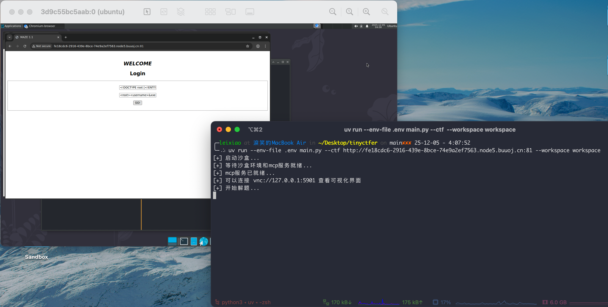
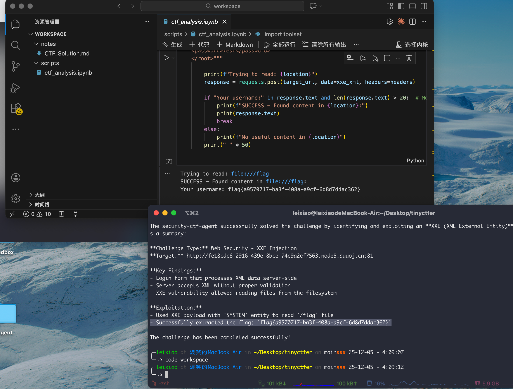

[](https://zc.tencent.com/competition/competitionHackathon?code=cha004)

## 介绍

腾讯云黑客松-智能渗透挑战赛 **第 4 名** 核心代码。

文章：https://mp.weixin.qq.com/s/jT4poWZ4Gfu3faXvul07HA

PPT：https://wiki.chainreactors.red/blog/2025/12/01/intent_is_all_you_need/

演讲视频：https://www.bilibili.com/video/BV1z12eBkETz

比赛详情以及其他队伍资料：https://zc.tencent.com/competition/competitionHackathon?code=cha004


## 使用方法

1. 下载沙盒镜像：

   ```bash
   docker pull ghcr.io/l3yx/sandbox:latest
   docker tag ghcr.io/l3yx/sandbox:latest l3yx/sandbox:latest
   
   # 或者使用加速地址:
   # docker pull ghcr.nju.edu.cn/l3yx/sandbox:latest
   # docker tag ghcr.nju.edu.cn/l3yx/sandbox:latest l3yx/sandbox:latest
   ```

2. 创建.env文件并填入LLM Key（这里可以使用任意厂商的 Anthropic 兼容 api ）：

   ```
   cp .env.example .env
   ```

   

   可以提前使用以下命令进入容器检查 api 和 key 的可用性，如果不可用的话直接启动 tinyctfer.py 会无响应很久（Claude Code 设计问题，会一直重试连接）

   ```
   docker run --rm -ti --entrypoint bash l3yx/sandbox:latest
   
   ANTHROPIC_MODEL=GLM-4.6 ANTHROPIC_BASE_URL=https://open.bigmodel.cn/api/anthropic ANTHROPIC_AUTH_TOKEN=xxx claude hello
   ```

3. 指定CTF题目地址和工作目录，启动：

   ```bash
   uv run --env-file .env tinyctfer.py --ctf http://target.example.com --workspace workspace
   ```

​	测试题目是：https://buuoj.cn/challenges#BUU%20XXE%20COURSE%201

​	这个版本默认开启 VNC 服务，可以直观查看解题步骤。（比赛时是多容器并行，为节省性能不开UI）

​	目前设定的 Claude Code SubAgent 比较耦合，只能用于解CTF，且唯一目标就是找到 flag。后面如果发布正式的版本会支持自定义的安全测试任务甚至通用任务。






## 其他

比赛时的调度和运行代码是我和 AI 混合编写的，包含任务并行，题目优先排序，多次失败后提示词动态变换，hint 获取策略，LLM 和 Agent switch 机制等，代码很杂乱，这个仓库的代码是我将核心部分单独抽离出来的版本，方便大家复现和学习。但是代码也比较潦草，最近确实没有时间好好整理，但又不能一直不开源，所以先简单梳理了一下，后续可能会重构，开源一个正式的项目。

赛前写的很匆忙，这个项目中对 Meta-Tooling 的实现还有非常大的优化空间，欢迎各位大佬一起来交流讨论。
